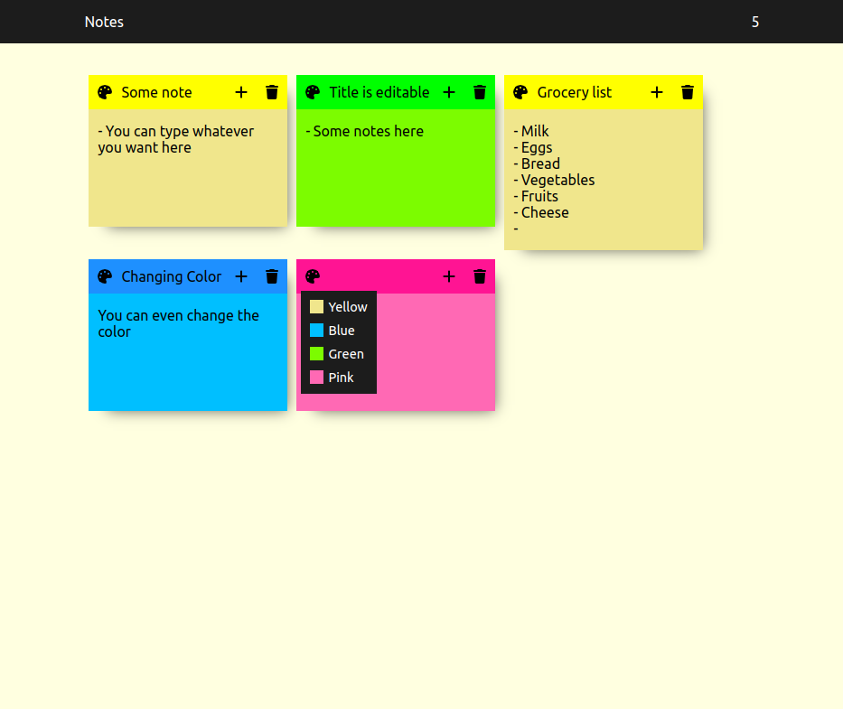

(In Progress) Simple SPA that allows the user to register and manage notes like post-its. The goal of the project is apply and consolidate the basic React concepts like component creation, component hierarchy, data passing between components, basic hooks and state management.
I used react-fontawesome and CSS flexbox too.
It is not saving data on a data base for now.

